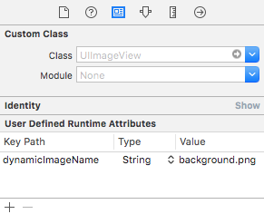

# UIImage+Autoresize

## Description

#### One library to rule them all!

This library automatically generates UIImage objects fitting the current device's orientation, size and scale.
Working on iPhones and iPads on portrait and landscape modes, it will add, if needed, a suffix to the given image filename in order to find and display the correct asset.

The suffixes are described as [requirements](https://github.com/kevindelord/UIImage-Autoresize/tree/master#requirements).

#### Original problem & solution

With Xcode, at the moment, it is pretty hard to use the xcassets logic to deal with image backgrounds for [all devices](http://www.paintcodeapp.com/news/ultimate-guide-to-iphone-resolutions) supporting all interface orientation.
You could maybe achieve such thing with [Size Class](https://developer.apple.com/library/ios/recipes/xcode_help-IB_adaptive_sizes/chapters/SelectingASizeClass.html) and the [customized assets](https://developer.apple.com/library/ios/recipes/xcode_help-image_catalog-1.0/chapters/CustomizingImageSetsforSizeClasses.html) (if so please, contact me).

But the easiest solution so far, is still to link one picture to one interface-oriented-screen-size.

This library is here for you!

## Requirements

Through the categorised class `UIImage+Autoresize`, a naming convention is applied to deal with different image files.
The following suffixes are expected:

| Vertical    | Horizontal  | Devices |
|:------------|:------------|:---------|
| none        | -l          | 3GS and earlier |
| @2x         | -l@2x       | iPhone 4, 4S |
| -568h@2x    | -320h-l@2x  | iPhone 5, 5C, 5S, SE, iPhone 6 Zoomed Mode |
| -667h@2x    | -375h-l@2x  | iPhone 6 Standard Mode |
| @3x         | -l@3x       | iPhone 6 Plus Standard Mode |
| -667h@3x    | -375h-l@3x  | iPhone 6 Plus Zoomed Mode |
| -512h       | -384h-l     | iPad Mini, iPad 2, iPad 1 |
| -1024h@2x   | -768h-l@2x  | iPad Mini 3, iPad Mini 2, iPad Air, iPad Air 2, iPad Pro (9.7 inch) |
| -1366h@2x   | -1024h-l@2x | iPad Pro (12,9 inch) |

## Integration

### [CocoaPods](http://cocoapods.org)

Add the following to your `Podfile`:

    pod "UIImage+Autoresize"

And import the header file:

    #import "UIImage+Autoresize.h"

### [Carthage](https://github.com/Carthage/Carthage)

Add the following to your `Cartfile`:

    github "kevindelord/UIImage-Autoresize"

And import the framework:

    // Swift
    import UIImageAutoresize
    // Obj-C
    #import <UIImageAutoresize/UIImage+Autoresize.h>

## Usage

When this class is integrated into your project, you can instantiate an image in your code as you usually do:

    [UIImage imageNamed: @"background.png" ];

The code will `automatically` load an image corresponding to the current device.

You do NOT need to specify any _custom_ file extension.
If you do, the library will ignore its own methods and only load the file you are asking for.

**Important:** To avoid edge cases and bugs, always specify the image type: `.png`, `.jpg`, etc. 

## Storyboard integration

It is possible to directly set the image name within an UIImageView in the storyboard. At runtime the default image set will be replaced by the one required by the current screen size and orientation.

To do so, you need to add an `User Defined Runtime Attribute` to the UIImageView object.

The key should be `"dynamicImageName"` and the value the basic image filename `"background.png"`:

## Rotating screen: Portrait & Landscape modes

When dealing with multiple interface orientations, an application might need different backgrounds.
One for the portrait mode and another one for the landscape.

With `UIImage+Autoresize` and its naming convention you could even use the same asset name in the code.
The displayed picture will simply change by implementing the folloying methods in your view controller:

Starting iOS 8:

    - (void)viewWillTransitionToSize:(CGSize)size withTransitionCoordinator:(id<UIViewControllerTransitionCoordinator>)coordinator {
        [super viewWillTransitionToSize:size withTransitionCoordinator:coordinator];
        self.imageView.image = [UIImage imageNamed:@"background.png" withTransitionSize:size];
    }

On iOS 7 and earlier:

    - (void)didRotateFromInterfaceOrientation:(UIInterfaceOrientation)fromInterfaceOrientation {
        [super didRotateFromInterfaceOrientation:fromInterfaceOrientation];
        self.imageView.image = [UIImage imageNamed:@"background.png"];
    }

**Important:**  Those functions and logics are also required when integrating the picture using the storyboard.

### Tips

If you are implementing a multi interface orientations app, it would be good to do the first initialization of your UIImageView in the `viewWillAppear`.
This way, you should have less problems when the orientation change while a child view controller is presented.
When the user pops back, the previous background will look as it should.

## Swift

The library works with Swift as smooth as it does in Obj-C. Nothing to worry about :)

## Documentation

This pod is also documented on [CocoaDocs](http://cocoadocs.org/docsets/UIImage+Autoresize)

## Example

Run the project itself !

	$> pod try UIImage+Autoresize

## Special thanks to

Dennis Rieth for the assets, dennis@ieth.de

[@waywalker](https://github.com/waywalker) and [@jzblog](https://github.com/jzblog) for the feedbacks.

## Author

kevindelord, delord.kevin@gmail.com

## License

UIImage+Autoresize is available under the [MIT license](https://github.com/kevindelord/UIImage-Autoresize/blob/master/LICENSE).
